# Kubernetes集群部署（Ack-Distro）服务实例部署文档

## 概述

Kubernetes集群部署（Ack-Distro）是计算巢官方提供的基于Ack-Distro部署K8S集群的服务。关于Ack-Distro，请参见[Ack-Distro](https://github.com/AliyunContainerService/ackdistro/)
本文向您介绍根据该服务部署实例的流程和使用说明。

## 计费说明

Kubernetes集群部署（Ack-Distro）在计算巢上的费用主要涉及：

- 所选vCPU与内存规格
- 系统盘类型及容量
- 数据盘类型及容量（可选）
- 负载均衡
- 公网NAT（可选）
- 负载均衡绑定的公网（可选）
- master节点与worker节点公网（可选）

计费方式包括：

- 按量付费（小时）
- 包年包月

预估费用在创建实例时可实时看到。

## 部署架构
1. 多节点部署  
    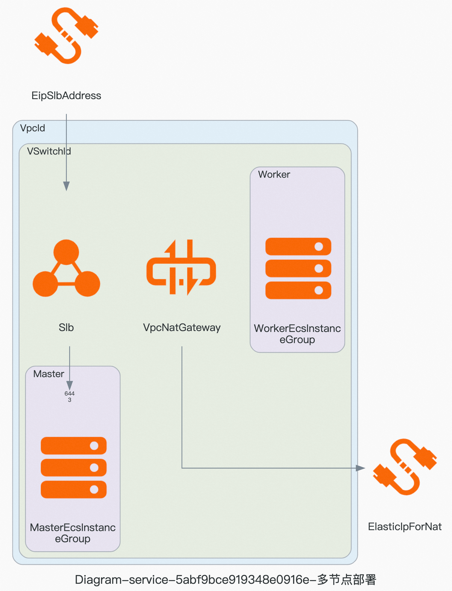 

## RAM账号所需权限
Kubernetes集群部署（Ack-Distro）服务需要对ECS、VPC等资源进行访问和创建操作，若您使用RAM用户创建服务实例，需要在创建服务实例前，对使用的RAM用户的账号添加相应资源的权限。添加RAM权限的详细操作，请参见[为RAM用户授权](https://help.aliyun.com/document_detail/121945.html)。所需权限如下表所示。

| 权限策略名称 | 备注 |
| --- |:----|
| AliyunECSFullAccess | 管理云服务器服务（ECS）的权限 |
| AliyunVPCFullAccess | 管理专有网络（VPC）的权限 |
| AliyunROSFullAccess | 管理资源编排服务（ROS）的权限 |
| AliyunSLBFullAccess | 管理负载均衡（SLB）的权限 |
| AliyunNATGatewayFullAccess | 管理NAT网关(NAT Gateway)的权限 |
| AliyunEIPFullAccess | 管理弹性公网IP(EIP)的权限 |
| AliyunComputeNestUserFullAccess | 管理计算巢服务（ComputeNest）的用户侧权限 |
| AliyunCloudMonitorFullAccess | 管理云监控（CloudMonitor）的权限 |

## 部署流程

### 部署步骤
单击[部署链接](https://computenest.console.aliyun.com/user/cn-hangzhou/serviceInstanceCreate?ServiceId=service-d760a958340f4a5e99d8)，进入服务实例部署界面，根据界面提示，填写参数完成部署。

### 部署参数说明
您在创建服务实例的过程中，需要配置服务实例信息。下文介绍Kubernetes集群部署（Ack-Distro）服务实例输入参数的详细信息。

| 参数组     | 参数项               | 示例           | 说明                                                                        |
|---------|-------------------|--------------|---------------------------------------------------------------------------|
| 服务实例名称  |                   | test         | 实例的名称                                                                     |
| 地域      |                   | 华东1（杭州）      | 选中服务实例的地域，建议就近选中，以获取更好的网络延时。                                              |
| 可用区配置   | 部署区域              | 可用区I         | 地域下的不同可用区域                                                                |
| 付费类型配置  | 付费类型              | 按量付费 或 包年包月  |
| 负载均衡配置  | 负载均衡实例规格          | 简约型I(slb.s1.small) | 默认将为 API Server 创建一个私网 SLB 实例，用户可修改SLB实例规格。若删除该实例会导致 API Server 无法访问。 |
| Ack-Distro镜像版本  | Ack-Distro基础镜像版本  | v1-22-15-ack-10 |  Ack-Distro镜像版本，[版本说明](https://github.com/AliyunContainerService/ackdistro/releases/?spm=5176.24779694.0.0.3f1a4d22HAfVBL)。 |
| 网络配置    | 专有网络VPC实例ID       | vpc-xxxx     | 现有虚拟专有网络的实例ID。      |                                                        |
| 网络配置    | 交换机实例ID           |  vsw-xxx    | 现有业务网络交换机的实例ID。    |
| 网络配置    | 配置SNAT            |  True    | 为专有网络配置SNAT，这样集群节点和应用将具有公网访问能力。若您所选的VPC中已有绑定了弹性公网的NAT网关，ACK将默认使用该网关。 |
| 网络配置    | 创建EIP用于API Server |  True   | 创建Eip，并将该EIP与内网SLB实例绑定，获得从公网访问集群 API Server 的能力。 |
| Master实例配置 | 节点数量              | 2 | Master节点数量，最少为1。                         |
| Master实例配置 | 实例类型              | ecs.gn6i-c4g1.xlarge | 实例规格，Master节点不可小于2核4G，否则可能会创建失败。                     |
| Master实例配置 | 系统盘类型             | ESSD云盘 | 系统盘类型，须选择实例支持的磁盘类型。                       |
| Master实例配置 | 系统盘空间             | 40 | 系统盘大小, 取值范围：[40, 500], 单位：GB。                         |
| Master实例配置 | 创建master节点数据盘     | True | 是否需要创建master节点数据盘        |
| Master实例配置 | 数据盘类型             | 2 | 数据盘类型，须选择实例支持的磁盘类型。                         |
| Master实例配置 | 数据盘空间             | 2 | 数据盘大小, 取值范围：[40, 500], 单位：GB。                             |
| Master实例配置 | 开启master节点公网      | True | 为每个master节点都创建公网IP，方便远程ssh登录。 |
| Worker实例配置 | 节点数量              | 2 | Worker节点数量，最少为1。                         |
| Worker实例配置 | 实例类型              | ecs.gn6i-c4g1.xlarge | 实例规格，Worker节点不可小于1核2G，否则可能会创建失败。                     |
| Worker实例配置 | 系统盘类型             | ESSD云盘 | 系统盘类型，须选择实例支持的磁盘类型。                       |
| Worker实例配置 | 系统盘空间             | 40 | 系统盘大小, 取值范围：[40, 500], 单位：GB。                         |
| Worker实例配置 | 创建master节点数据盘     | True | 是否需要创建worker节点数据盘        |
| Worker实例配置 | 数据盘类型             | 2 | 数据盘类型，须选择实例支持的磁盘类型。                         |
| Worker实例配置 | 数据盘空间             | 2 | 数据盘大小, 取值范围：[40, 500], 单位：GB。                             |
| Worker实例配置 | 开启worker节点公网      | True | 为每个worker节点都创建公网IP，方便远程ssh登录。 |
| 节点密码配置 | 实例密码              | ********     | Master节点与Worker节点登录密码。长度8~30个字符，必须包含三项（大写字母、小写字母、数字、()`~!@#$%^&*-+={}[]:;'<>,.?/ 中的特殊符号） |

### 部署Demo

1. 查看服务实例。服务实例创建成功后，部署时间大约需要10分钟。部署完成后，页面上可以看到对应的服务实例。

2. 通过服务实例访问集群。进入到对应的服务实例后，可以在页面上获取到获取集群访问凭证的3种方式。获取集群访问凭证方式:  
   方式1：运维管理页中，选择执行"获取集群公网（私网）凭证"运维项，在执行结果中查看凭证。 
   方式2：远程连接master节点，公网访问凭证：~/.kube/external_ip_config，私网访问凭证： ~/.kube/internal_ip_config  
   方式3： 
   1.登录阿里云ECS控制台:https://ecs.console.aliyun.com/cloud-assistant/region/cn-huhehaote/
   。 
   2.查看该命令执行Id: t-aseifjale4asdf 的执行结果。
   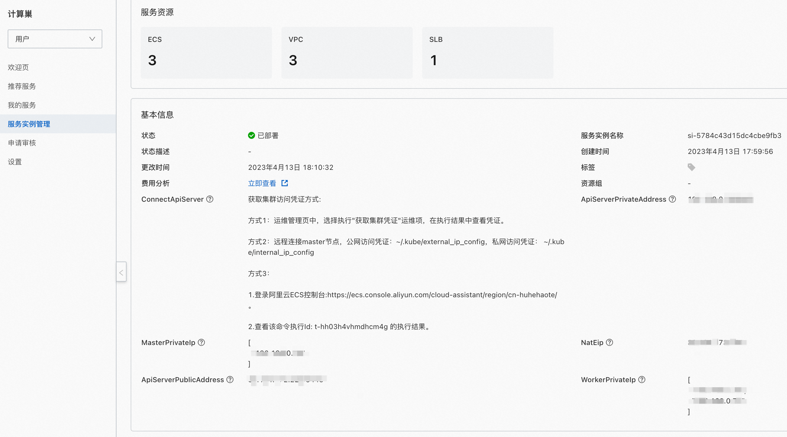

3. 以方式1为例获取集群公网凭证（如果部署时为勾选"创建EIP用户ApiServer"则只有集群私网凭证）。  
   a. 点击运维管理页的"获取集群公网凭证"：
   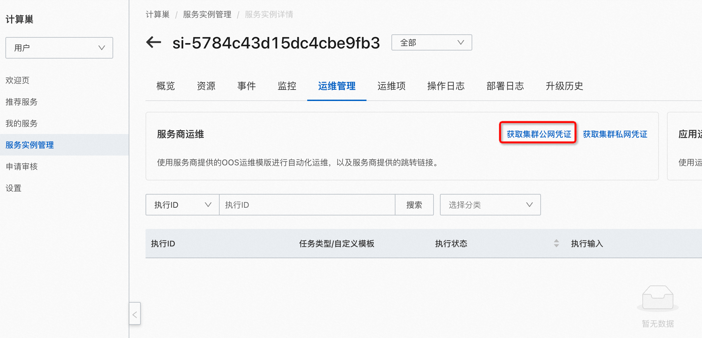
   b. 点击"创建"：
   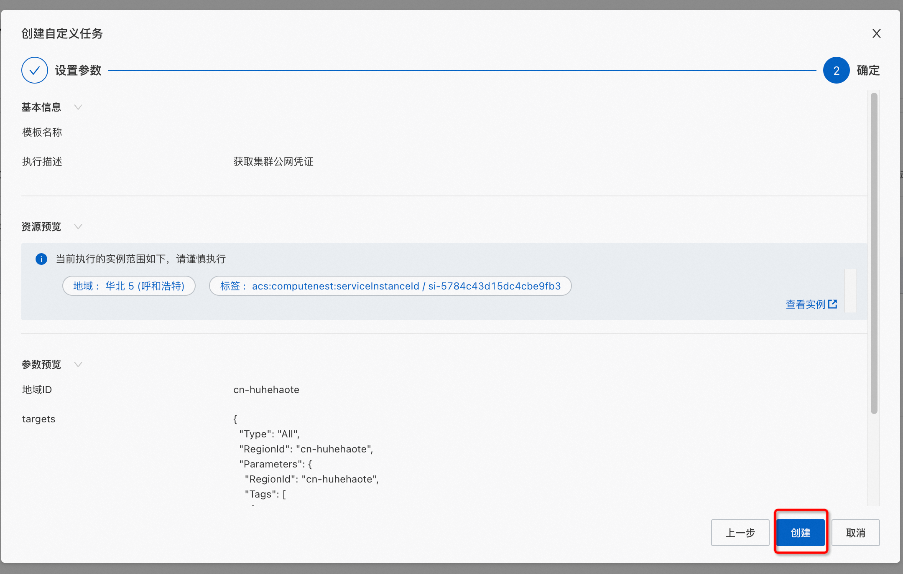
   c. 执行完成后查看输出并复制到本机的 ~/.kube/config
   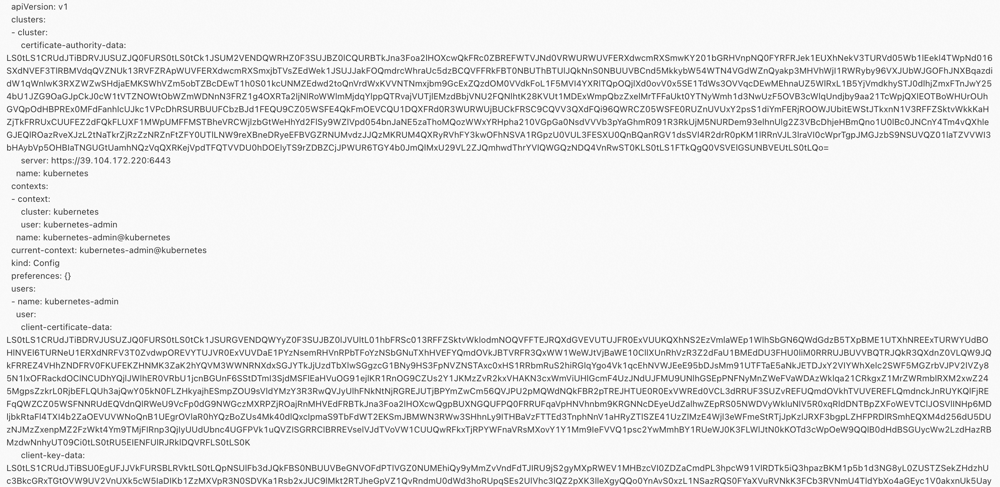
   d. 确保复制到本机后，并安装了k8s客户端后，[如何安装Kubectl](https://kubernetes.io/docs/tasks/tools/)，执行命令测试：
   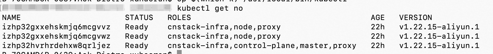
  

4. 以方式2为例获取集群内（私）网凭证  
   a. 在服务实例详情-资源中选择后缀为 master-001 的服务实例,并远程连接
   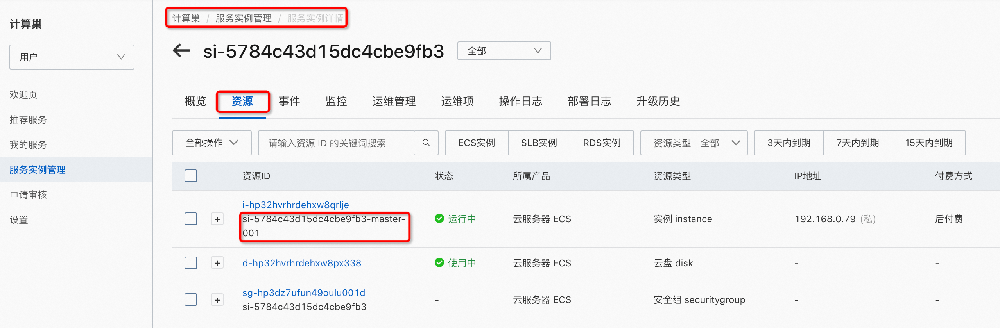
   b. 远程连接如果选择"会话管理"，需要进入机器后执行su root，然后查看凭证
   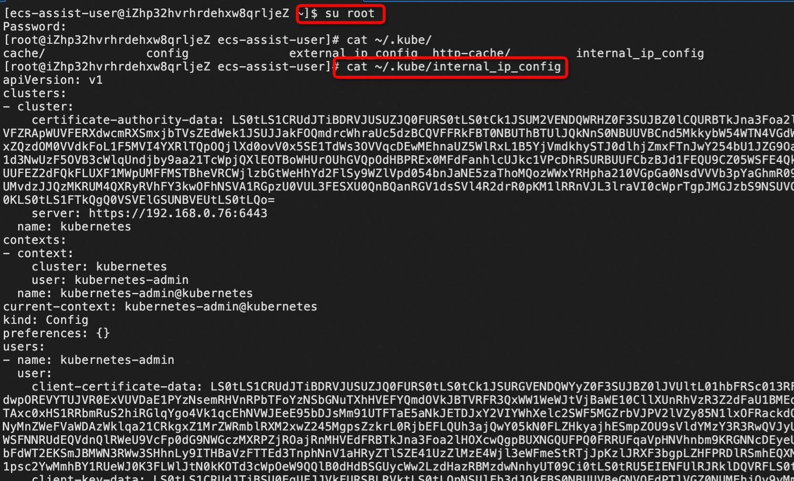
   c. 后续步骤同 3.d
  

5. 以方式3为例获取集群公网凭证  
   a. 复制该命令执行Id
   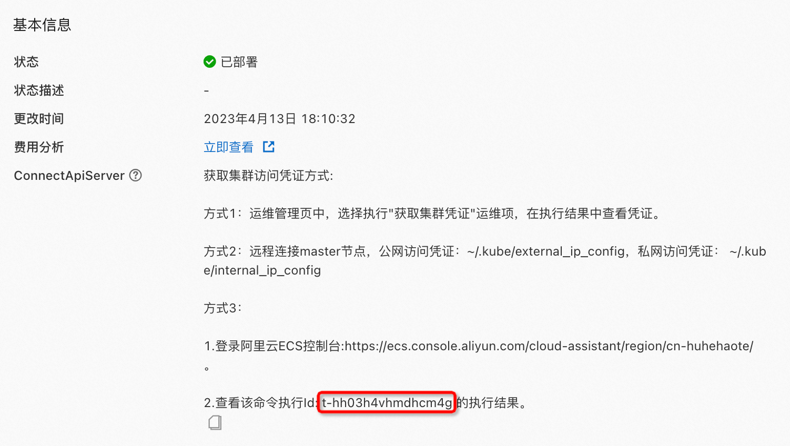
   b. 在ECS控制台的云助手页面查看该命令执行Id的结果
   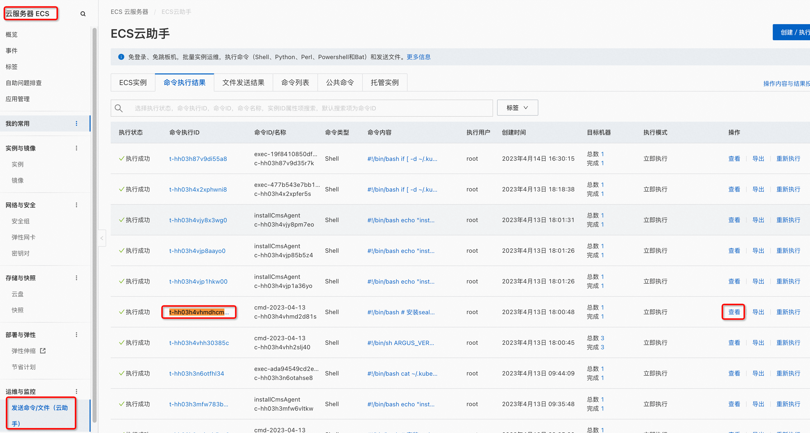     
   c. 在结果中可以将配置文件复制到本机
   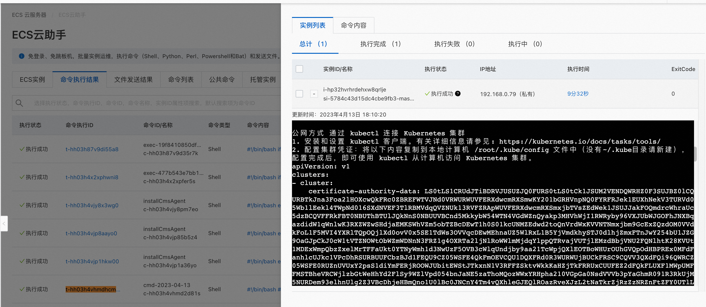  
   d. 后续步骤同 3.d

## 集群扩缩容
创建好服务实例后，可以执行一些运维操作，其中便包括集群扩缩容，下面介绍如何进行扩缩容。

### 扩容
1. 点击运维管理页的"弹性扩缩容"
   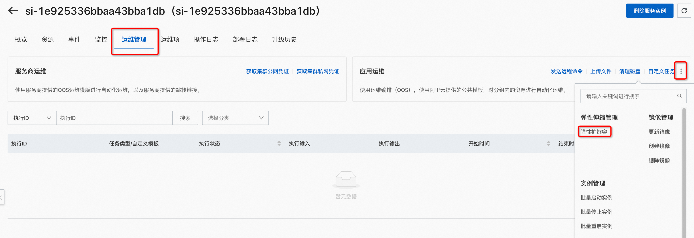
2. 选择伸缩组。扩缩容Worker节点数量可以选择k8s-worker-asg开头的伸缩组，扩缩容Master节点则选择k8s-master-asg开头的，以Worker节点为例
   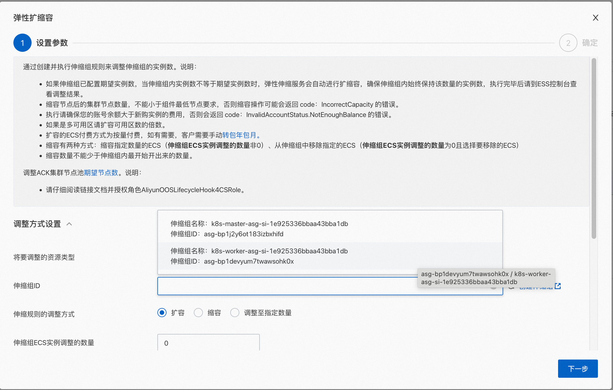
   1. 选择扩容或者调整至指定数量
   2. 输入伸缩组ECS实例调整数量
   3. 点击下一步，然后点击创建
   4. 等待执行完成后即可进行验证
   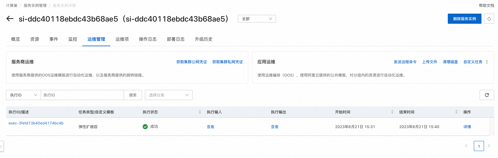

### 缩容
1. 点击运维管理页的"弹性扩缩容"
2. 选择伸缩组。扩缩容Worker节点数量可以选择k8s-worker-asg开头的伸缩组，扩缩容Master节点则选择k8s-master-asg开头的，以Worker节点为例
   1. 选择缩容或者调整至指定数量
   2. 输入伸缩组ECS实例调整数量
   3. 点击下一步，然后点击创建
   4. 等待执行完成后即可进行验证

